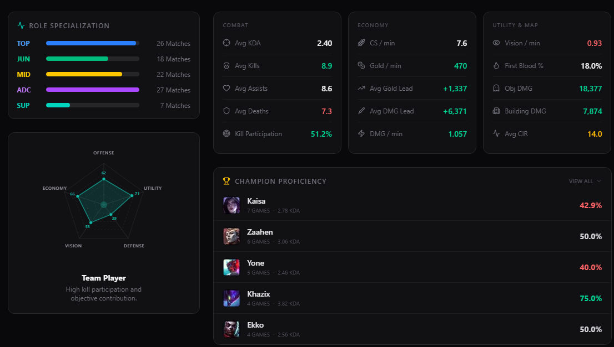

1. Create an object and map @PlayerStatsGrid., we are repeating too many times @StatRow, also, get the color corrresponding of the CIR value @PlayerStatsGrid.tsx#L238 @MatchHistoryList.tsx#L103

2. @MatchHistoryList.tsx#L103 Show the total matches played of the player, not the array of matches taht we are showing

3. @MatchHistoryList.tsx#L185 change this to cs per min

4. Create a ruslbe funtion or search if there is alredy created one to get the color corrresponding of the CIR value @MatchHistoryList.tsx#L207-230, and show only the first letter of the tier

5. To each stat give a certain width, so that the stats are not too close to each other and look like a table between matches

6. on @ChampionProficiency.tsx, instead of accordion make it a overflow scroll, and try to make it the same height of the left column 

7. Also, on @ChampionProficiency.tsx, with the wr show the avg of CIR with the champ

8. On @skinUlt.ts, give a optional prop to get a certain skin, if not given, get a random skin like is right now

9. On @RoleSpecialization.tsx, with the number of matches also show the average CIR on the role and the winrate

10. Mke @PlayerRadarChart.tsx stats more accuerate to the CIR calculation
